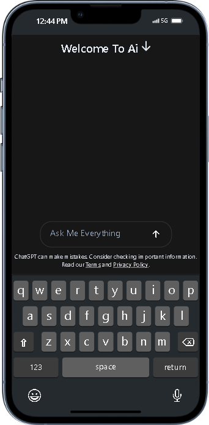
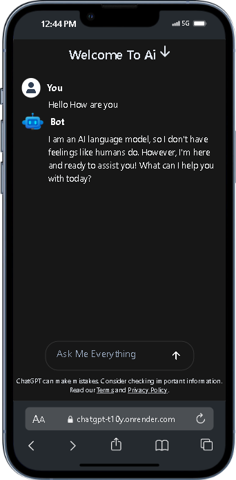

# Chat Gemni

Chat Gemini is a React.js project inspired by the Explore Logics professional website. It features modern design and functionality similar to chat applications like ChatGPT or Gemini. Explore services and information seamlessly through this intuitive interface.

## Demo

## 

### .env Content

VITE_Gemni_API_KEY
••••••••••••

VITE_Output_Tokens
••••••••••••

---

# Tech Stack

- : Frontend library for building user interfaces.
- : React rendering library for web applications.
- : Typed superset of JavaScript that compiles to plain JavaScript.
- : Pluggable linting utility for JavaScript and TypeScript.
- : Fast frontend development server and bundler.
- : Utility-first CSS framework for rapid UI development.
- : PostCSS plugin to parse CSS and add vendor prefixes automatically.
- : CSS post-processor that helps transform styles with JavaScript plugins.
- : ESLint plugin for React hooks.
- : ESLint plugin for React refresh.

**Project Images**

## Contributing

Contributions are welcome! If you'd like to contribute to this project, feel free to open an issue or submit a pull request.

## License

This project is licensed under the [MIT License](LICENSE).

---

## Feel free to customize the content according to your specific project details and requirements.
